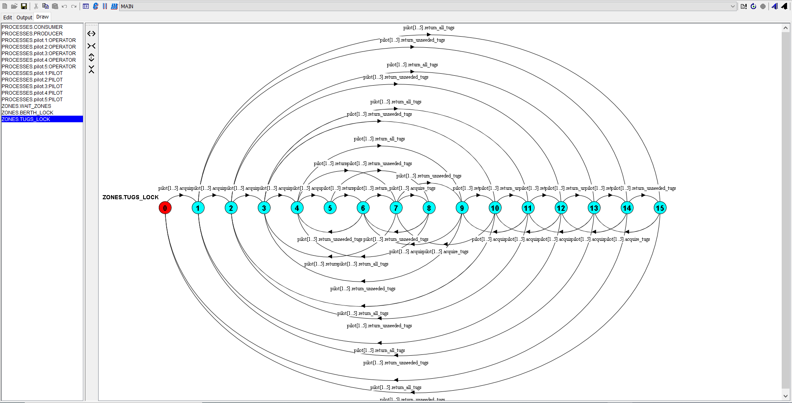

# Space station concurrent simulation

This program concurrently simulates a space station with ships coming into dock, docking and unloading, and leaving. The shield will be deployed every so often not allowing undocked ships to dock and docked ships to undock. It prints these actions to the console.

An Labelled Transtitioned System Analyser (LTSA) file (verification.lts) is also included for verifying the integrity of the concurrent system.

Skeleton code by Nick Geard, concurrency and locking mechanisms by Anthony Miller.

## Getting started

This is a standard Java project with no maven dependency management and is thus compiled and run in the standard fashion.

```bash
javac *.java
java Main
```

## Testing 

This project utilizes the LTSA for verifying the integrity of concurrent systems and asserts that there are no deadlocks, livelocks or starvation in the system under any circumstances. You can download the analyser here https://www.doc.ic.ac.uk/ltsa/

With the provided assertions if it compiles then there should be no adverse concurrent behaviour. However if you compose the file it will explore the 2 ** 35 state space exhaustively. Alternatively you can compile then 'draw' the file to view the state transitions in a relatively easy to understand state diagrams as seen below.




